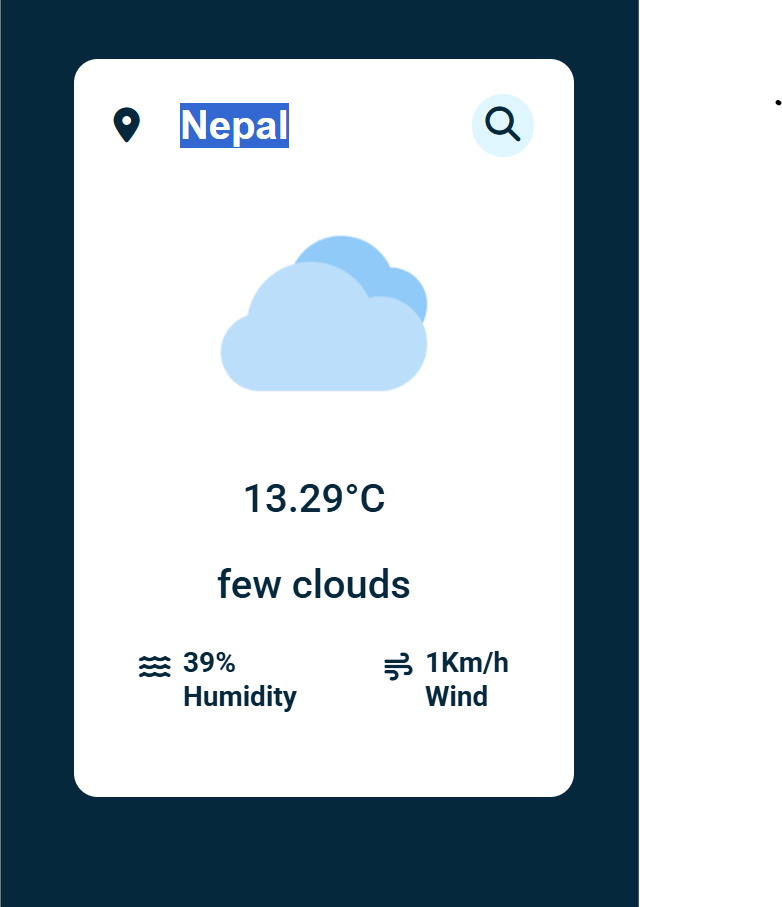

# 🌤️ Weather API Checker  

A simple and fast weather application that fetches real-time weather data using an API. Get accurate weather forecasts for any location!  

## 🚀 Features  
✅ Get real-time weather data (temperature, humidity, wind speed, etc.)  
✅ Search weather by city name or coordinates  
✅ Responsive and user-friendly interface  
✅ Supports multiple weather conditions (clear, rainy, cloudy, etc.)  

## 🛠 Technologies Used  
- **Frontend:** HTML, CSS, JavaScript  
- **API:** OpenWeatherMap / WeatherAPI
- **Backend (if applicable):** Node.js, Express.js  

🌦️ Weather Results



### 1️⃣ Clone the Repository  
```sh
git clone https://github.com/KIHs0/WeatherChecker.git
